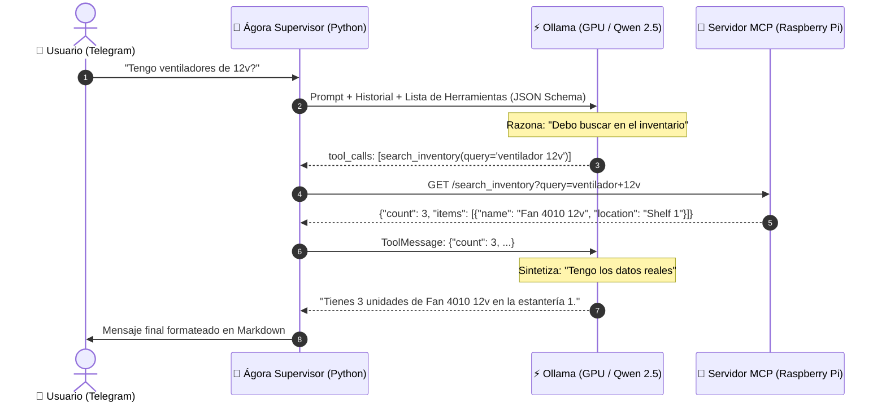

# 🤖 Arquitectura del Motor de Agentes y el LLM

Este documento explica con detalle pedagógico y de ingeniería cómo el código Python de **Ágora** se conecta con el modelo local de **Ollama**, cómo razona el agente mediante el ciclo **ReAct** y cómo se ejecutan las llamadas a herramientas (*Tool Calling / Function Calling*).

---

## 🧩 1. De Chatbot a Agente: La Diferencia Fundamental

Un **Chatbot tradicional** es puramente pasivo y conversacional:
```text
Usuario: "¿Qué filamentos tengo?" ➔ LLM: "No lo sé, soy un modelo de lenguaje." (O alucina una lista inventada).
```

Un **Agente de IA (como Ágora)** es activo y está dotado de **herramientas (Tools)** y **capacidad de decisión (Reasoning)**:
```text
Usuario: "¿Qué filamentos tengo?" 
  ↳ 1. Agente RAZONA: "Para responder necesito consultar el inventario de Spoolman".
  ↳ 2. Agente ACTÚA: Emite una llamada a la herramienta `query_workshop_filaments()`.
  ↳ 3. Sistema EJECUTA: Hace una petición HTTP a Spoolman en la Raspberry Pi.
  ↳ 4. Agente OBSERVA: Lee el JSON real recibido (12 filamentos, colores y pesos).
  ↳ 5. Agente RESPONDE: Redacta una respuesta fundamentada en hechos 100% reales.
```

---

## 🔄 2. El Ciclo ReAct (Reason + Act)

Ágora implementa el paradigma **ReAct (Reasoning and Acting)**. Cada vez que le envías un mensaje por Telegram o CLI, se dispara un bucle iterativo que consta de los siguientes pasos:



---

## 🛠️ 3. Anatomía de una Llamada a Herramienta (*Tool Calling*)

Para que el modelo LLM sepa qué herramientas existen y cómo usarlas, Ágora le envía una **definición estricta de esquema JSON** en el parámetro `tools`.

### Ejemplo de cómo se define una herramienta en código (`app/agents/supervisor.py`):
```python
TOOLS_DEFINITION = [
    {
        "type": "function",
        "function": {
            "name": "query_workshop_filaments",
            "description": "Consulta el inventario de bobinas de filamento 3D en Spoolman. Permite filtrar por material y color.",
            "parameters": {
                "type": "object",
                "properties": {
                    "material": {
                        "type": "string",
                        "description": "Material del filamento (ej: 'PLA', 'PETG', 'TPU')."
                    },
                    "color": {
                        "type": "string",
                        "description": "Color del filamento (ej: 'Red', 'White', 'Blue')."
                    }
                },
                "required": []
            }
        }
    }
]
```

### ¿Qué hace el modelo con esta definición?
1. El modelo LLM no ejecuta código Python por sí mismo.
2. Cuando el modelo decide usar una herramienta, interrumpe la generación de texto normal y genera un objeto estructurado especial:
```json
{
  "tool_calls": [
    {
      "name": "query_workshop_filaments",
      "args": {
        "material": "PLA"
      }
    }
  ]
}
```
3. El código de Ágora captura ese objeto, llama a la función Python correspondiente (`fetch_filaments_from_mcp()`), y le devuelve el resultado al LLM como un mensaje de rol `tool`.

---

## 🛡️ 4. El Mecanismo de Fallback y Resiliencia en Ágora

No todos los modelos open-source devuelven las llamadas a herramientas con el formato JSON perfecto de OpenAI. Modelos más pequeños o experimentales a veces escriben la llamada dentro del texto plano.

Para que Ágora nunca se rompa ante un modelo imperfecto, `app/agents/supervisor.py` incluye un **parser de seguridad tolerante a fallos (`parse_raw_tool_calls`)**:

```python
def parse_raw_tool_calls(text: str) -> List[Dict[str, Any]]:
    """
    Si el modelo no emitió tool_calls de forma nativa por API pero escribió
    el JSON en el cuerpo del mensaje, esta función extrae el JSON oculto y lo ejecuta.
    """
    results = []
    if not text:
        return results
    for i, ch in enumerate(text):
        if ch == '{':
            for j in range(len(text), i + 1, -1):
                chunk = text[i:j].strip()
                if chunk.endswith('}'):
                    try:
                        d = json.loads(chunk)
                        if isinstance(d, dict) and ('name' in d or 'tool' in d):
                            name = d.get('name', d.get('tool'))
                            args = d.get('arguments', d.get('args', {}))
                            results.append({'name': name, 'args': args, 'id': name})
                            break
                    except Exception:
                        pass
            if results:
                break
    return results
```

---

## 🧠 5. Gestión de Memoria y Ventana de Contexto

El supervisor de Ágora mantiene el contexto conversacional mediante un historial de mensajes ordenado por roles:

```text
1. SystemMessage: "Eres Ágora, el supervisor del homelab... Instrucciones estrictas..."
2. HumanMessage: "¿Qué filamentos tengo?"
3. AIMessage: (Llamada a tool query_workshop_filaments)
4. ToolMessage: "[{name: Sunlu PLA+ White, remaining: 154g}, ...]"
5. AIMessage: "Tienes Sunlu PLA+ White con 154g..."
6. HumanMessage: "¿Y puedo usarlo para imprimir la bandera?"
```

### Límites de memoria y truncamiento inteligente:
- En cada turno, Ágora pasa los **últimos 6 turnos** (`conversation_history[-6:]`) para evitar saturar la ventana de contexto de 4096 o 8192 tokens.
- De este modo, la GPU no desperdicia memoria VRAM releyendo conversaciones antiguas de días atrás, pero mantiene fresca la memoria inmediata de la sesión actual.

---

## 🏆 6. Requisitos de un Modelo para ser un Buen Agente

Para que un modelo funcione con éxito como agente en Ágora, debe cumplir 3 requisitos técnicos:

1. **Soporte Nativo de Tool Calling (JSON Schema):** Capacidad de pausar la respuesta y emitir un payload JSON sin alucinar que ejecuta la herramienta en su cabeza (ej. `qwen2.5:14b-instruct`).
2. **Seguimiento Estricto de Instrucciones (System Prompt Adherence):** Debe respetar la directiva de no inventar datos numéricos cuando una herramienta devuelve `0` o datos incompletos.
3. **Mantenimiento del Estado Contextual:** No contradecirse entre el turno $N$ y el turno $N+1$.
