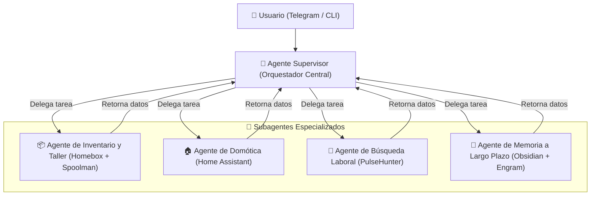

# 🧩 Guía de Creación de Agentes y Subagentes

Este documento es una guía práctica paso a paso para que cualquier desarrollador pueda extender **Ágora**, creando nuevos agentes especializados (Workers), conectando nuevas herramientas y configurando subagentes coordinados por el Supervisor.

---

## 🏗️ 1. Filosofía de Diseño: El Patrón Supervisor-Worker

Ágora utiliza una arquitectura jerárquica de agentes:



### ¿Por qué dividir en Subagentes?
1. **Evitar la sobrecarga de herramientas:** Si le das 50 herramientas a un solo modelo, se confunde o elige la herramienta equivocada.
2. **System Prompts especializados:** Un agente de domótica solo necesita saber de luces y termostatos; un agente de inventario solo necesita saber de ubicaciones y materiales 3D.
3. **Aislamiento y tolerancia a fallos:** Si falla una API externa, solo el subagente correspondiente reporta el error sin tirar abajo el resto del bot.

---

## 🏭 2. La Fábrica de Agentes (`app/agents/factory.py`)

Ágora incluye una fábrica estandarizada construida sobre `langchain_ollama` y `langgraph`:

```python
# app/agents/factory.py
from typing import List, Any
from langchain_ollama import ChatOllama
from langgraph.prebuilt import create_react_agent
from app.core.config import settings

def get_base_llm(temperature: float = 0.0) -> ChatOllama:
    """Devuelve la instancia configurada del LLM local de Ollama."""
    return ChatOllama(
        base_url=settings.ollama_base_url,
        model=settings.ollama_model,
        temperature=temperature
    )

def build_worker_agent(name: str, system_prompt: str, tools: List[Any]):
    """Fábrica estándar para construir sub-agentes ReAct."""
    llm = get_base_llm(temperature=0.0)
    return create_react_agent(
        model=llm,
        tools=tools,
        prompt=system_prompt,
        name=name
    )
```

---

## 🛠️ 3. Tutorial Práctico: Cómo crear un nuevo Subagente desde Cero

Imagina que queremos crear un nuevo **"Agente de Impresión 3D y Filamentos"** (`FilamentAdvisorAgent`).

### Paso 1: Crear las Herramientas Python (`app/tools/3d_printer_tools.py`)
Decoramos las funciones con `@tool` de LangChain o definimos funciones asíncronas limpias:

```python
# app/tools/filament_tools.py
from langchain_core.tools import tool
import httpx

@tool
def check_spool_stock(material: str) -> str:
    """Consulta el stock restante de un material de filamento en Spoolman."""
    try:
        r = httpx.get(f"http://192.168.0.66:8001/query_filaments?material={material}", timeout=4.0)
        return r.text
    except Exception as e:
        return f"Error al consultar Spoolman: {str(e)}"
```

### Paso 2: Crear el Agente Especializado (`app/agents/filament_agent.py`)
Definimos su System Prompt y usamos la fábrica:

```python
# app/agents/filament_agent.py
from app.agents.factory import build_worker_agent
from app.tools.filament_tools import check_spool_stock

FILAMENT_SYSTEM_PROMPT = """
Eres el Asesor Experto en Impresión 3D y Materiales de Ágora.
Tu objetivo es recomendar el material adecuado (PLA, PETG, TPU, etc.) basándote ÚNICAMENTE en el inventario real de Spoolman.
Si no hay stock de un material, indícalo claramente y sugiere alternativas disponibles.
"""

def create_filament_agent():
    return build_worker_agent(
        name="filament_advisor",
        system_prompt=FILAMENT_SYSTEM_PROMPT,
        tools=[check_spool_stock]
    )
```

### Paso 3: Registrar la Herramienta en el Supervisor (`app/agents/supervisor.py`)
En el archivo del Supervisor principal:

1. Importamos la función o herramienta.
2. La añadimos a la lista `TOOLS_DEFINITION`.
3. La enlazamos en el diccionario de despacho de funciones (`tools_map` o `execute_tool`).

```python
# En app/agents/supervisor.py
from app.tools.filament_tools import check_spool_stock

# Añadir a TOOLS_DEFINITION para que el modelo sepa que existe:
TOOLS_DEFINITION.append({
    "type": "function",
    "function": {
        "name": "check_spool_stock",
        "description": "Consulta el inventario de bobinas en Spoolman por material.",
        "parameters": {
            "type": "object",
            "properties": {
                "material": {"type": "string", "description": "Material (ej. PLA, PETG)"}
            },
            "required": ["material"]
        }
    }
})
```

---

## 🔒 4. Buenas Prácticas al Redactar System Prompts

Un buen prompt de agente debe tener 4 secciones obligatorias:

1. **Identidad y Rol:** Quién es y cuál es su responsabilidad ("Eres el especialista en...").
2. **Reglas Negativas (Guardrails):** Lo que NUNCA debe hacer ("Nunca inventes cantidades ni nombres de piezas").
3. **Criterio de Uso de Herramientas:** Cuándo debe llamar a la herramienta ("Antes de responder sobre stock, SIEMPRE consulta `check_spool_stock`").
4. **Formato de Respuesta:** Cómo debe presentar los datos ("Usa listas con viñetas y destaca el peso en gramos en negrita").

### Ejemplo de Guardrail anti-alucinación:
```text
REGLA CRÍTICA: Si la herramienta devuelve 0 resultados, responde estrictamente que no hay stock registrado. NO asumas ni inventes que existen piezas basándote en suposiciones.
```
