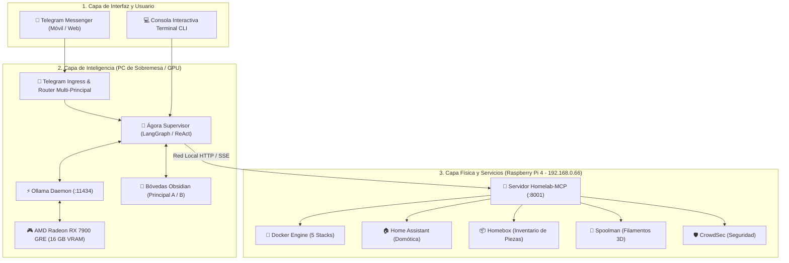

# 📚 El Gran Libro de Ágora: Manual de Arquitectura, Replicación y Operación

Bienvenido al manual maestro de **Ágora**. Este documento consolida la arquitectura completa del sistema, explica cómo replicarlo desde cero en una máquina limpia y proporciona una guía de referencia rápida para el día a día.

---

## 🗺️ 1. Mapa Mental del Ecosistema Completo

Ágora es una plataforma de **asistentes de inteligencia artificial locales y distribuidos**, compuesta por tres grandes capas:



---

## 📖 2. Índice de la Documentación Completa

Para profundizar en cualquier aspecto específico del sistema, consulta los manuales dedicados en la carpeta `docs/`:

1. [Manual Completo de Ollama Autónomo](file:///home/colls/github/agora/docs/MANUAL_OLLAMA_AUTONOMO.md): Arquitectura de Ollama, variables de entorno, comandos CLI, gestión de VRAM, GPU AMD y servicios systemd.
2. [Arquitectura del Motor de Agentes y el LLM](file:///home/colls/github/agora/docs/ARQUITECTURA_AGENTES_Y_LLM.md): Ciclo ReAct, Tool Calling con JSON Schema, esquemas de llamadas y ventana de contexto.
3. [Guía de Creación de Agentes y Subagentes](file:///home/colls/github/agora/docs/GUIA_CREACION_AGENTES_Y_SUBAGENTES.md): Fábrica de agentes, tutorial paso a paso para añadir un agente y buenas prácticas de prompts.
4. [Pasarela de Entrada y Sistema Multiusuario](file:///home/colls/github/agora/docs/TELEGRAM_Y_MULTIUSUARIO.md): Telegram Bot API, BotFather, seguridad por ID y perfiles Principal A / B aislados.
5. [MCP y Conexión con Servicios Externos](file:///home/colls/github/agora/docs/MCP_Y_SERVICIOS_EXTERNOS.md): Protocolo MCP, FastMCP en Raspberry Pi, integración con Homebox, Spoolman y Home Assistant.
6. [Guía de Modelos Recomendados](file:///home/colls/github/agora/docs/MODELS_RECOMMENDATION.md): Comparativa de modelos (Qwen 2.5 vs DeepSeek R1 vs Qwen 3) para la GPU AMD RX 7900 GRE.

---

## 🚀 3. Guía de Replicación: Cómo montar Ágora en una Máquina Nueva desde Cero

Si mañana quieres instalar Ágora en otro ordenador o servidor Linux limpio:

### Paso 1: Requisitos previos del sistema
```bash
# Actualizar repositorios e instalar paquetes base
sudo apt update && sudo apt install -y python3 python3-venv git curl lsof jq

# Si tienes GPU AMD, instalar ROCm y drivers gráficos
# (En Arch/CachyOS: paru -S rocm-hip-runtime rocm-opencl-runtime)
```

### Paso 2: Instalar y verificar Ollama
```bash
# Instalar Ollama oficial
curl -fsSL https://ollama.com/install.sh | sh

# Descargar el modelo recomendado para agentes
ollama pull qwen2.5:14b-instruct
```

### Paso 3: Clonar y configurar Ágora
```bash
git clone https://github.com/tu-usuario/agora.git ~/github/agora
cd ~/github/agora

# Crear entorno virtual de Python
python3 -m venv .venv
source .venv/bin/activate

# Instalar dependencias
pip install -r requirements.txt # o pip install langchain-ollama langgraph python-telegram-bot httpx pydantic psutil
```

### Paso 4: Crear el archivo de entorno `.env`
```bash
cp .env.example .env
nano .env
```
Configura tus tokens de Telegram y las URLs de Ollama y de la Raspberry Pi.

### Paso 5: Iniciar el stack
```bash
./start.sh
```

---

## ⚡ 4. Cheatsheet del Día a Día: Comandos Esenciales

| Acción | Comando |
| :--- | :--- |
| **Iniciar Ágora y Ollama** | `./start.sh` (en la carpeta `~/github/agora`) |
| **Ver estado y consumo de VRAM** | `./status.sh` |
| **Detener todo y liberar GPU** | `./stop.sh` |
| **Ver logs del Bot en vivo** | `tail -f ~/github/agora/logs/agora.log` |
| **Ver logs de Ollama en vivo** | `tail -f ~/github/agora/logs/ollama.log` |
| **Listar modelos en disco** | `ollama list` |
| **Ver qué modelo está en VRAM** | `ollama ps` |
| **Descargar un modelo nuevo** | `ollama pull <nombre_modelo>` |
| **Borrar un modelo** | `ollama rm <nombre_modelo>` |
| **Consola interactiva CLI** | `.venv/bin/python main.py cli principal_a` |
