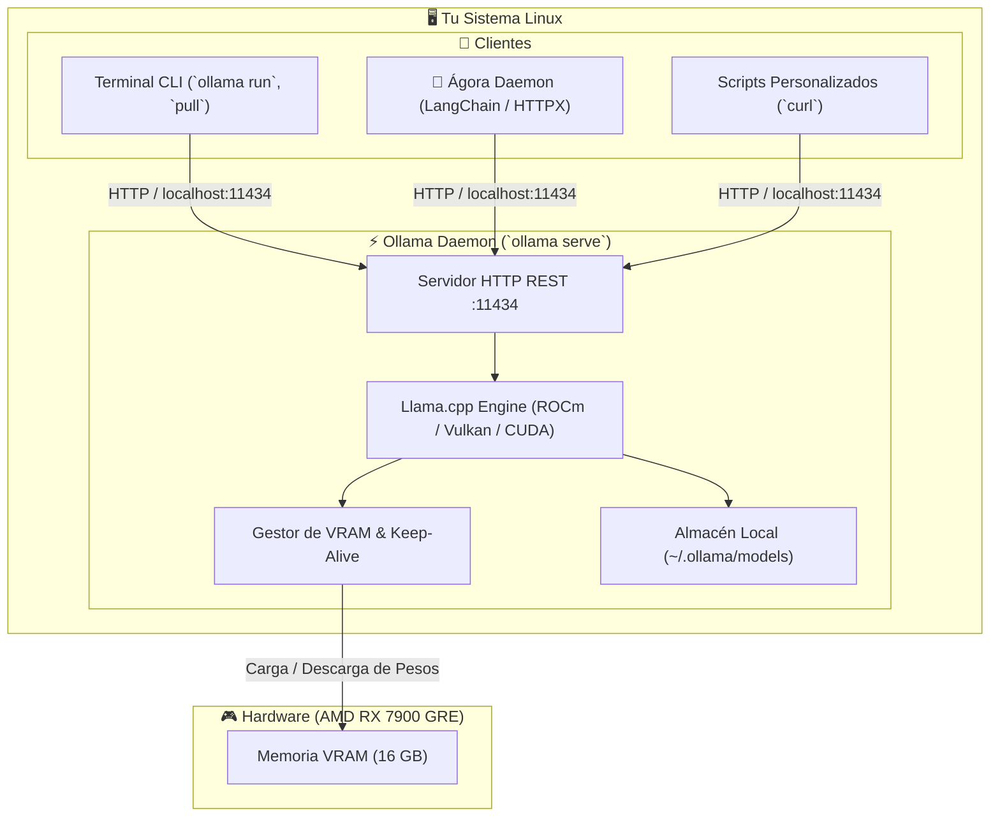

# 📖 Manual Completo de Ollama Autónomo

Este documento es una guía técnica exhaustiva para comprender, operar, automatizar y depurar **Ollama** de forma 100% autónoma en un entorno Linux, sin depender de asistentes ni scripts externos.

---

## 🏛️ 1. Arquitectura Interna de Ollama

Ollama no es un simple ejecutable que corre un modelo; funciona con una arquitectura **Cliente-Servidor (Daemon-Client)**:



### Componentes clave:
1. **El Demonio (`ollama serve`):** Es el proceso en segundo plano que escucha peticiones HTTP en el puerto `11434`, administra la memoria GPU (VRAM), compila y ejecuta los grafos de cómputo en C++ (`llama.cpp`) y descarga los pesos de los modelos.
2. **El Cliente CLI (`ollama <comando>`):** Es una interfaz de línea de comandos que envía llamadas REST a `http://127.0.0.1:11434`.
3. **El Motor de Inferencia:** Detecta dinámicamente tu tarjeta gráfica (en tu caso AMD Radeon con soporte ROCm / Vulkan) y descarga las capas del modelo directamente en la VRAM.

---

## 🌐 2. Puertos de Red y Variables de Entorno

### Puerto por defecto: `11434`
Ollama escucha por defecto únicamente en `127.0.0.1:11434` (localhost).

### Variables de entorno críticas:

| Variable | Valor Típico | Descripción |
| :--- | :--- | :--- |
| `OLLAMA_HOST` | `0.0.0.0:11434` o `127.0.0.1:11434` | IP y puerto donde escucha el servidor. Si quieres acceder desde la red local, usa `0.0.0.0:11434`. |
| `OLLAMA_MODELS` | `/home/colls/.ollama/models` | Directorio físico donde se almacenan los modelos descargados. |
| `OLLAMA_KEEP_ALIVE`| `5m`, `1h`, `-1` | Tiempo que el modelo permanece en VRAM tras la última petición. `-1` lo mantiene siempre en VRAM; `0` lo descarga inmediatamente al responder. |
| `OLLAMA_NUM_PARALLEL`| `1`, `2`, `4` | Número de peticiones de chat simultáneas que el modelo puede procesar a la vez. |
| `OLLAMA_MAX_LOADED_MODELS` | `1` | Cuántos modelos distintos pueden convivir en VRAM a la vez (en 16 GB conviene dejarlo en `1`). |
| `HSA_OVERRIDE_GFX_VERSION` | `11.0.0` (o similar) | Obligatorio en ciertas GPUs AMD si ROCm no reconoce la arquitectura nativa. |

### Cómo definir variables de entorno al iniciar:
```bash
# Ejemplo: Iniciar Ollama escuchando en toda la red local con keep_alive de 30 minutos
OLLAMA_HOST=0.0.0.0:11434 OLLAMA_KEEP_ALIVE=30m ollama serve
```

---

## 🚀 3. Ciclo de Vida: Cómo arrancar y parar Ollama

### Método 1: En primer plano (para depuración)
Abre una terminal y ejecuta:
```bash
ollama serve
```
*Verás todos los logs en tiempo real (detección de GPU, peticiones entrantes, consumo de memoria).* Para detenerlo: `Ctrl + C`.

### Método 2: En segundo plano manual (Background con logs)
```bash
# Iniciar en segundo plano redirigiendo logs a un archivo
nohup ollama serve > ~/ollama.log 2>&1 &

# Ver el PID del proceso creado
echo $!

# Comprobar que responde
curl http://127.0.0.1:11434/api/tags
```

Para detener el proceso en segundo plano:
```bash
pkill -f "ollama serve"
```

### Método 3: Como Servicio del Sistema (`systemd`)
Si deseas que Ollama arranque automáticamente al encender tu PC:

1. Crear el archivo del servicio:
```bash
sudo nano /etc/systemd/system/ollama.service
```

2. Añadir la configuración:
```ini
[Unit]
Description=Ollama Service
After=network-online.target

[Service]
ExecStart=/usr/bin/ollama serve
User=colls
Group=colls
Restart=always
RestartSec=3
Environment="OLLAMA_HOST=127.0.0.1:11434"
Environment="OLLAMA_MODELS=/home/colls/.ollama/models"
Environment="OLLAMA_KEEP_ALIVE=5m"

[Install]
WantedBy=default.target
```

3. Activar y gestionar el servicio:
```bash
sudo systemctl daemon-reload
sudo systemctl enable ollama.service   # Iniciar con el sistema
sudo systemctl start ollama.service    # Iniciar ahora
sudo systemctl status ollama.service   # Ver estado
sudo systemctl stop ollama.service     # Parar
sudo journalctl -u ollama.service -f  # Ver logs en vivo
```

---

## 📦 4. Gestión de Modelos: CLI Completa

Ollama incluye un conjunto de comandos CLI directos:

### 1. Listar modelos descargados en disco
```bash
ollama list
```
*Salida: Nombre, ID de hash, tamaño en GB y fecha.*

### 2. Ver modelos activos actualmente en la GPU (VRAM)
```bash
ollama ps
```
*Salida: Qué modelo está ocupando la tarjeta gráfica, porcentaje de GPU asignado y cuánto tiempo le queda de `keep_alive`.*

### 3. Descargar un modelo nuevo
```bash
ollama pull <nombre_del_modelo>
# Ejemplos:
ollama pull qwen2.5:14b-instruct
ollama pull deepseek-r1:14b
ollama pull llama3.1:8b
```

### 4. Eliminar un modelo para liberar espacio
```bash
ollama rm <nombre_del_modelo>
# Ejemplo:
ollama rm qwen3.5:9b
```

### 5. Probar un modelo directamente en la consola interactiva
```bash
ollama run qwen2.5:14b-instruct
# Escribe tu consulta y pulsa Enter. Para salir escribe: /bye
```

### 6. Inspeccionar los metadatos y plantilla (Modelfile) de un modelo
```bash
ollama show qwen2.5:14b-instruct --modelfile
ollama show qwen2.5:14b-instruct --parameters
ollama show qwen2.5:14b-instruct --system
```

---

## 📁 5. Estructura de Archivos en Disco

En sistemas Linux, Ollama guarda todo en tu directorio personal:

```text
/home/colls/.ollama/models/
├── blobs/       <-- Archivos binarios gigantes (capas GGUF, tensores y pesos sha256)
└── manifests/   <-- Metadatos JSON que conectan los nombres con los blobs
    └── registry.ollama.ai/
        └── library/
            ├── qwen2.5/
            │   └── 14b-instruct
            └── deepseek-r1/
                └── 14b
```

> [!WARNING]
> **Regla de oro:** Nunca borres archivos a mano dentro de `blobs/` con `rm -rf`, a menos que sean archivos temporales atascados (`*-partial*`). Para desinstalar modelos usa siempre `ollama rm <nombre>`.

---

## 🎮 6. Monitoreo de GPU y VRAM en AMD Radeon

Tu tarjeta gráfica es una **AMD Radeon RX 7900 GRE (16 GB VRAM)**.

### Comandos para monitorizar la GPU en Linux:
1. **`ollama ps`:** Te dice exactamente cuánto de tu modelo está dentro de la VRAM (debe indicar `100% GPU`).
2. **`radeontop`:** Monitoriza en tiempo real el porcentaje de uso de los núcleos de cómputo y bus de la gráfica:
   ```bash
   sudo radeontop
   ```
3. **`rocm-smi`:** Muestra la temperatura de la gráfica, velocidad de ventiladores y consumo exacto de VRAM en MB:
   ```bash
   rocm-smi
   ```

### ¿Cómo liberar la VRAM al instante sin reiniciar Ollama?
Si un modelo se quedó cargado en la VRAM y quieres vaciar la memoria para jugar o usar otra app:
```bash
# Envía una petición con keep_alive=0 para forzar la descarga de memoria
curl http://localhost:11434/api/generate -d '{"model": "qwen2.5:14b-instruct", "keep_alive": 0}'
```

---

## 📡 7. API HTTP REST: Cómo comunicarse con Ollama mediante código

Cualquier lenguaje de programación (Python, Node.js, Bash, Go) puede interactuar con Ollama haciendo peticiones HTTP estándar:

### 1. Endpoint `/api/chat` (El que usa Ágora)
Envía un historial de mensajes y recibe la respuesta estructurada:

```bash
curl http://localhost:11434/api/chat -d '{
  "model": "qwen2.5:14b-instruct",
  "messages": [
    {"role": "system", "content": "Eres un asistente técnico conciso."},
    {"role": "user", "content": "¿Qué es un microcontrolador?"}
  ],
  "stream": false
}'
```

### 2. Endpoint `/api/tags` (Listar modelos vía API)
```bash
curl -s http://localhost:11434/api/tags | jq .
```

### 3. Endpoint `/api/ps` (Ver qué modelo está en VRAM vía API)
```bash
curl -s http://localhost:11434/api/ps | jq .
```

### 4. Endpoint `/api/pull` (Descargar modelos vía API)
```bash
curl http://localhost:11434/api/pull -d '{"name": "qwen2.5:14b-instruct"}'
```

---

## 🛠️ 8. Guía de Solución de Problemas Frecuentes

### ❌ Error: `could not connect to ollama server, run 'ollama serve' to start it`
* **Causa:** El proceso demonio de Ollama no está corriendo.
* **Solución:** Ejecuta `ollama serve &` o inicia tu script `./start.sh`.

### ❌ Error: `bind: address already in use (port 11434)`
* **Causa:** Ya hay otra instancia de Ollama o proceso escuchando en el puerto 11434.
* **Solución:**
  ```bash
  # Ver qué proceso ocupa el puerto
  sudo lsof -i :11434
  # Matar la instancia anterior
  pkill -f "ollama serve"
  ```

### ❌ Error: `i/o timeout` o `Error: max retries exceeded: EOF` al hacer pull
* **Causa 1:** Bloqueo de red o microcortes en el CDN de Cloudflare R2.
* **Causa 2:** Fragmentos parciales corruptos en `~/.ollama/models/blobs/`.
* **Solución:**
  ```bash
  # 1. Limpiar archivos corruptos
  rm -f ~/.ollama/models/blobs/*-partial*
  # 2. Reintentar la descarga
  ollama pull <modelo>
  ```
