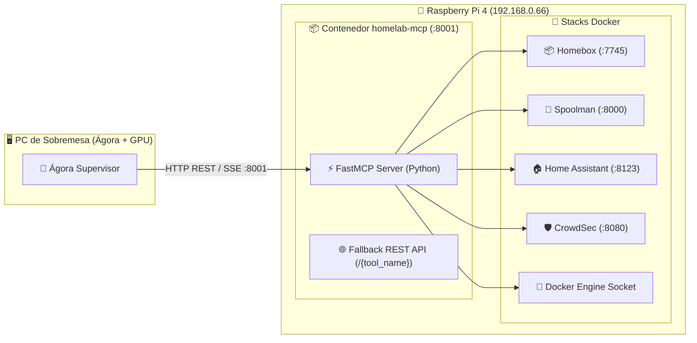

# 🔌 MCP (Model Context Protocol) y Servicios Externos

Este documento es el manual técnico de la capa de integración física y de servicios de **Ágora**, explicando cómo se comunica con la **Raspberry Pi 4**, los contenedores Docker, **Homebox**, **Spoolman** y **Home Assistant** a través del protocolo **MCP (Model Context Protocol)**.

---

## 🏛️ 1. ¿Qué es MCP y por qué lo usamos?

El **Model Context Protocol (MCP)** es un estándar abierto que permite a los modelos de lenguaje conectarse a fuentes de datos y herramientas de ejecución de forma segura, tipada y modular.



### Ventajas de esta arquitectura:
1. **Desacoplamiento total:** Si la Raspberry Pi se reinicia o se corta la red, Ágora no se cae; simplemente informa al usuario con elegancia (*Graceful Degradation*).
2. **Seguridad:** El modelo no tiene acceso directo SSH a la Pi; solo puede ejecutar las funciones explícitamente permitidas por el servidor MCP.
3. **Cero carga en la Pi:** El modelo de IA corre en la tarjeta gráfica del PC de sobremesa (RX 7900 GRE), dejando la CPU de la Pi 100% libre para domótica y Docker.

---

## 🛠️ 2. El Servidor MCP en la Pi (`homelab-mcp/server.py`)

El servidor MCP está construido con **FastMCP** y un router REST universal.

### Catálogo de Herramientas Implementadas:

| Herramienta | Servicio | Descripción |
| :--- | :--- | :--- |
| `get_homelab_overview` | Hardware / Docker | Métricas de CPU, RAM, temperatura SoC de la Pi y contenedores por stack. |
| `list_containers` | Docker Engine | Lista detallada de contenedores (running, exited) filtrable por stack. |
| `get_container_logs` | Docker Engine | Lee las últimas $N$ líneas de log de cualquier contenedor. |
| `restart_container` | Docker Engine | Reinicia de forma segura un contenedor (con whitelist estricta). |
| `search_inventory` | Homebox | Búsqueda multi-palabra y en español de repuestos con ubicación jerárquica exacta. |
| `add_inventory_item` | Homebox | Registra una nueva pieza o repuesto en una ubicación de Homebox. |
| `query_filaments` | Spoolman | Consulta bobinas de filamento 3D, materiales, colores y peso restante en gramos. |
| `get_home_summary` | Home Assistant | Resumen de temperaturas, luces activas y sensores abiertos. |
| `list_home_entities` | Home Assistant | Lista dispositivos y entidades filtrables por dominio (`light`, `climate`, etc.). |
| `get_entity_state` | Home Assistant | Consulta el valor exacto de un sensor o entidad concreta. |
| `call_home_service` | Home Assistant | Ejecuta una acción domótica (ej: encender/apagar una luz). |
| `get_crowdsec_status`| CrowdSec | Alertas de intrusión y bloqueos de seguridad recientes. |

---

## 🔍 3. Casos Especiales de Integración

### A. Homebox: Árbol Jerárquico de Ubicaciones y Traducción
* **Problema:** En Homebox, las piezas están en "Estantería 0", pero no se sabe de qué mueble.
* **Solución de Ágora:** `_fetch_locations_map()` consulta `/api/v1/locations/tree` y construye rutas legibles completas (ej: `Office > 3D printer cabinet > Shelf 0`).
* **Traducción automática:** Incluye un diccionario de sinónimos de taller (ej: `"ventilador"` ➔ `"fan"`, `"teclado"` ➔ `"keyboard"`) para que las búsquedas en español siempre encuentren los componentes en Homebox.

### B. Spoolman: Filtrado Tolerante a Comodines
* **Problema:** Los modelos a veces piden `query_filaments(material="todos", color="any")`, lo que provocaba que se filtrara todo y diera 0 resultados.
* **Solución de Ágora:** La lista `ignore_kw = {"all", "todos", "any", "none", "*", "cualquiera"}` descarta estos comodines y entrega el catálogo real de las 12 bobinas.

---

## ➕ 4. Cómo añadir una Nueva Herramienta MCP en 3 Pasos

Si mañana agregas un nuevo servicio a tu Homelab (por ejemplo, monitorizar descargas de Torrent o una impresora OctoPrint):

### Paso 1: Definir la función en `server.py` de la Pi
```python
# En 04-utilities/homelab-mcp/server.py
@mcp.tool()
def get_printer_status() -> str:
    """Consulta el estado actual de la impresora 3D (temperatura de cama y hotend)."""
    try:
        r = httpx.get("http://moonraker:7125/printer/info", timeout=3.0)
        return r.text
    except Exception as e:
        return json.dumps({"status": "error", "message": str(e)})
```

### Paso 2: Registrar el endpoint en el mapa REST (`tools_map`)
```python
tools_map["get_printer_status"] = get_printer_status
```

### Paso 3: Declarar la herramienta en Ágora (`app/agents/supervisor.py`)
Añades la descripción JSON a `TOOLS_DEFINITION` y la función en `tools_map` de Python para que el modelo la use automáticamente.
