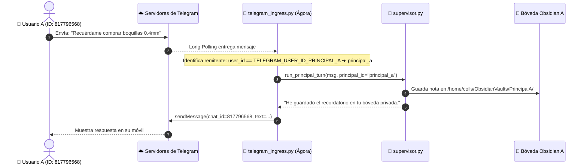
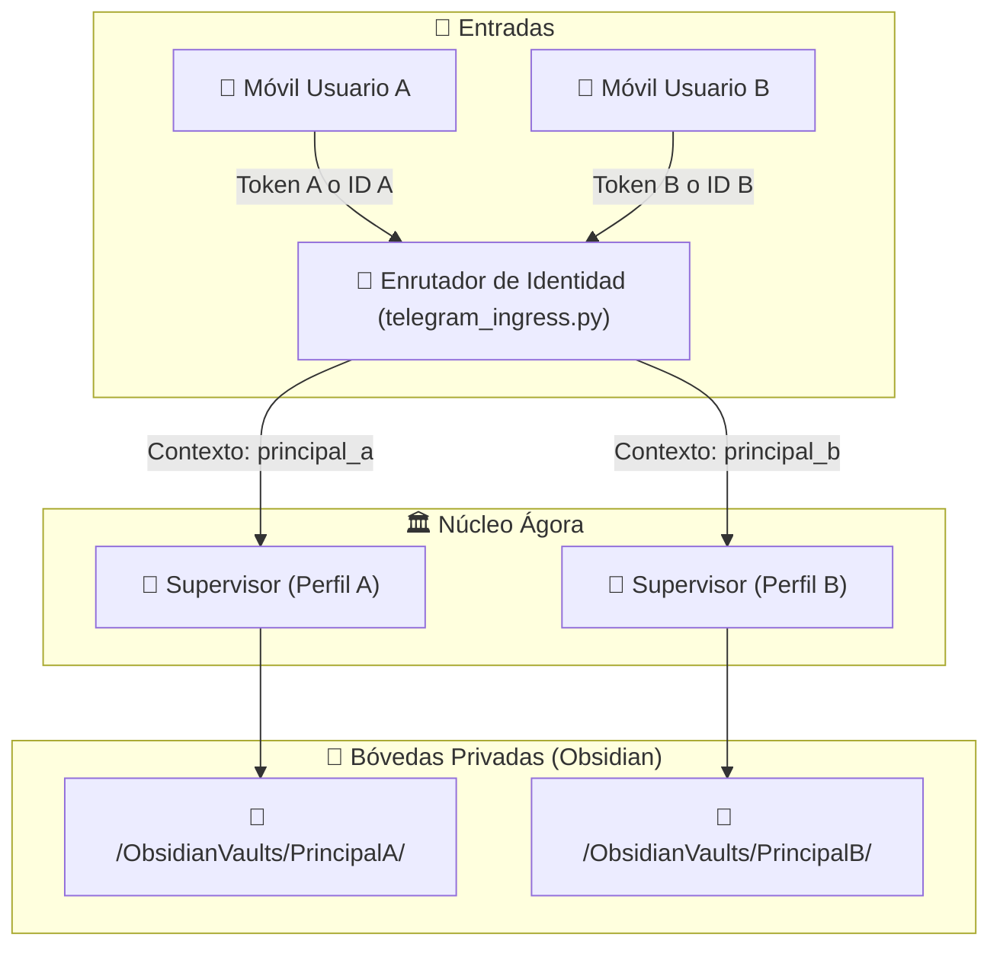

# 📱 Pasarela de Entrada (Telegram Ingress) y Sistema Multiusuario

Este documento explica cómo funciona la interfaz de mensajería de **Ágora**, cómo se configura el bot de Telegram desde cero y cómo opera el sistema de aislamiento de perfiles **Multi-Principal** (Principal A y Principal B).

---

## 🏗️ 1. Arquitectura de Entrada de Telegram

Ágora utiliza la librería oficial `python-telegram-bot` en modo asíncrono con el patrón **Long Polling (`getUpdates`)**:



---

## 🔑 2. Guía Paso a Paso: Crear un Bot de Telegram y Obtener Tokens

Si necesitas crear un bot nuevo o replicar el sistema en otra cuenta:

### Paso 1: Crear el Bot con `@BotFather`
1. Abre Telegram y busca al usuario verificado **`@BotFather`**.
2. Envía el comando `/newbot`.
3. Elige un nombre visible (ej: `Agora Homelab Bot`).
4. Elige un nombre de usuario único terminado en `bot` (ej: `agora_colls_bot`).
5. BotFather te responderá con tu **Token HTTP API** (un texto largo parecido a `8596320371:AAFAZFlHScVhEY0ro2lT3kviHlBWV09fbPM`).

### Paso 2: Obtener tu Telegram User ID Numérico
Para que el bot sepa quién eres y bloquee a desconocidos:
1. En Telegram, busca el bot **`@userinfobot`** o **`@raw_data_bot`**.
2. Pulsa *Iniciar*.
3. Te devolverá tu `Id` numérico único (ej: `817796568`).

### Paso 3: Configurar el archivo `.env` de Ágora
Abre `/home/colls/github/agora/.env` y define:
```env
# Perfil Principal A (Usuario Principal)
TELEGRAM_BOT_TOKEN_PRINCIPAL_A=8596320371:AAFAZFlHScVhEY0ro2lT3kviHlBWV09fbPM
TELEGRAM_USER_ID_PRINCIPAL_A=817796568
OBSIDIAN_VAULT_PRINCIPAL_A=/home/colls/ObsidianVaults/PrincipalA

# Perfil Principal B (Segundo Usuario opcional)
TELEGRAM_BOT_TOKEN_PRINCIPAL_B=
TELEGRAM_USER_ID_PRINCIPAL_B=
OBSIDIAN_VAULT_PRINCIPAL_B=/home/colls/ObsidianVaults/PrincipalB
```

---

## 👥 3. El Sistema Multi-Principal: Aislamiento Total

Ágora está diseñado para soportar **dos identidades totalmente independientes (Principal A y Principal B)** conviviendo en el mismo servidor:



### ¿Cómo garantiza el código la privacidad?
En `app/api/telegram_ingress.py`:
```python
def get_principal_id_by_user_id(user_id: int) -> Optional[str]:
    """Valida el ID de Telegram y asigna el perfil correspondiente."""
    if settings.telegram_user_id_principal_a and user_id == settings.telegram_user_id_principal_a:
        return "principal_a"
    if settings.telegram_user_id_principal_b and user_id == settings.telegram_user_id_principal_b:
        return "principal_b"
    return None
```

- Cada usuario tiene su propio historial de memoria en RAM (`chat_histories[user_id]`).
- Las notas, búsquedas y hechos se guardan estrictamente en la carpeta de Obsidian del usuario autenticado.
- Si un usuario desconocido intenta escribirle al bot, Ágora no ejecuta herramientas privadas y responde en modo restringido.

---

## 🕹️ 4. Modo CLI Interactivo (Sin depender de Telegram)

Si alguna vez no tienes conexión a internet o los servidores de Telegram tienen problemas, Ágora cuenta con una **consola interactiva directa en terminal**:

```bash
cd ~/github/agora
.venv/bin/python main.py cli principal_a
```

### Comandos especiales dentro de la consola CLI:
- `switch`: Cambia al instante entre el perfil `principal_a` y `principal_b`.
- `salir`, `exit` o `quit`: Cierra la sesión interactiva.
- Todo el razonamiento, llamadas a herramientas MCP y consultas de hardware funcionan exactamente igual que en Telegram.
