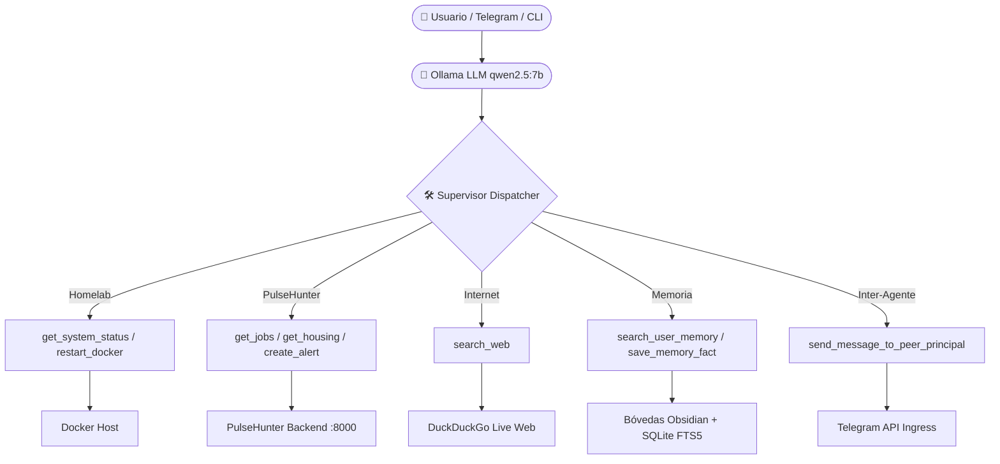

# 🛠️ Ágora Agent Tools & MCP Capability Catalog

Este documento recopila todas las herramientas (*Tools*), integraciones MCP y capacidades conectadas a los Agentes Principales en **Ágora**.

---

## 📋 Resumen de Herramientas Registradas

| Herramienta | Tipo | Destino / Origen | Descripción |
| :--- | :--- | :--- | :--- |
| `get_system_status` | Local System / Docker | Linux / Docker Engine | Obtiene métricas de CPU, RAM, uso de disco y estado de los contenedores Docker del Homelab. |
| `restart_docker_container` | Safe Action | Docker Engine | Reinicia un contenedor Docker. Si es un contenedor crítico (`traefik`, `postgres`, `homeassistant`), exige confirmación humana previa. |
| `get_pulsehunter_jobs` | MCP Client (REST) | PulseHunter API (`:8000`) | Busca y filtra ofertas de empleo tech por tecnología (`search`), país (`country`) y modalidad (`is_remote`). |
| `get_pulsehunter_housing` | MCP Client (REST) | PulseHunter API (`:8000`) | Consulta propiedades y pisos en alquiler en Irlanda (`county`, `max_price`, `min_bedrooms`). |
| `create_pulsehunter_alert` | MCP Client (REST) | PulseHunter API (`:8000`) | Crea una alerta de rastreo recurrente automatizada para empleo en PulseHunter. |
| `search_web` | External Service | Internet (DuckDuckGo Search) | Permite al agente buscar información en tiempo real en la web (clima, noticias, documentación, etc.). |
| `search_user_memory` | Disposable Index | SQLite FTS5 / Obsidian | Busca notas, hechos y decisiones pasadas en la bóveda privada de Markdown del Principal activo. |
| `save_memory_fact` | Obsidian Local IO | Bóveda Obsidian (`.md`) | Guarda una nota estructurada en la carpeta de Obsidian del usuario e indexa el contenido en SQLite. |
| `send_message_to_peer_principal` | Multi-User Ingress | Telegram Bot Channel | Enruta un mensaje o recordatorio al otro Principal autorizado en el sistema de forma segura. |

---

## 🏛️ Arquitectura de Ejecución

---

## ➕ ¿Cómo añadir una nueva Tool a Ágora?

Para dotar al agente de una nueva capacidad:
1. **Crear la función cliente**: en `app/tools/<nueva_herramienta>.py`.
2. **Definir el JSON Schema**: en la lista `TOOLS_DEFINITION` de `app/agents/supervisor.py`.
3. **Mapear la ejecución**: en `execute_tool_call()` de `app/agents/supervisor.py`.
4. **Actualizar el System Prompt**: agregando cuándo y cómo el agente debe usarla.
