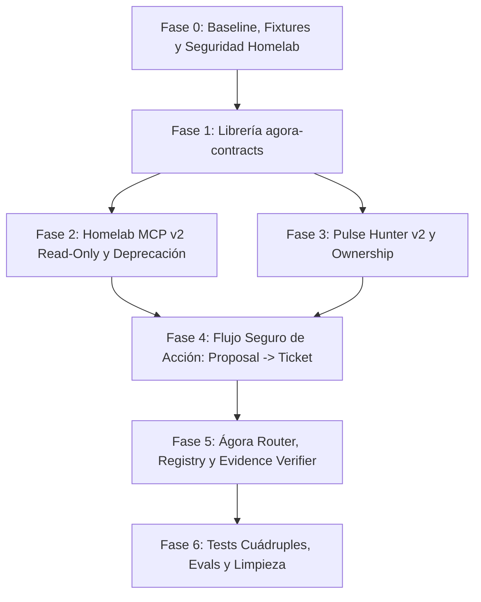

# 🚀 Plan Maestro Definitivo: Refactorización y Estandarización de Herramientas y MCPs (Ágora & Homelab)

> **Versión:** 2.0.0 (Revisada con Arquitectura Antropomórfica de Contexto y Seguridad)  
> **Objetivo:** Alinear el ecosistema de herramientas de **Ágora** y **Homelab** con las mejores prácticas de la industria:
> 1. Paquete de contratos compartidos agnóstico (`agora-contracts`).
> 2. Progresión de contexto y ahorro masivo de tokens (técnica *Progressive Disclosure*).
> 3. Blindaje de seguridad en Homelab MCP y ejecución desacoplada de mutaciones (*Human-in-the-Loop*).
> 4. Fiabilidad verificable del sistema en vez de afirmaciones irrealistas ("cero alucinaciones").

---

## 🧭 Principios Clave de la Arquitectura Refinada

### 1. Fiabilidad Verificable (No prometer "Cero Alucinaciones")
Los LLMs son probabilísticos. La arquitectura no promete "cero alucinaciones", sino **propiedades del sistema 100% verificables por el backend**:
* **Cero afirmaciones sin evidencia:** El respondedor no emite estado si el Evidence Verifier no tiene un `ToolResult` fresco.
* **Cero mutaciones directas del LLM:** Las herramientas de escritura solo devuelven un `ActionProposal`. El backend genera el `ActionTicket` y ejecuta tras confirmación de Telegram.
* **Cero mezcla entre perfiles:** `principal_a` y `principal_b` están aislados por scope autenticado inyectado por backend.
* **Cero sobrecarga de esquemas:** Exposición progresiva de herramientas (1 a 5 por turno).

### 2. Contratos Compartidos (`agora-contracts`)
Para evitar duplicidad y desincronización de modelos Pydantic entre `/home/colls/github/agora` y `/home/colls/github/homelab`, se crea una librería Python común instalable en modo editable (`pip install -e`).

### 3. Ahorro de Tokens: Revelación Progresiva (*Progressive Disclosure*)
Inspirado en los avances de Anthropic/Cloudflare ("Code Mode" con MCP):
* Las herramientas se consultan y cargan bajo demanda.
* Los resultados intermedios y datos voluminosos (logs de Docker, respuestas de 100 empleos) se resumen y acotan en el adaptador **antes** de llegar al contexto del LLM.

---

## 📊 Matriz de Fases de Ejecución



---

### 🛡️ FASE 0: Baseline, Seguridad de Red y Congelación de Comportamiento
*Objetivo: Evitar regresiones y cerrar vulnerabilidades de red antes de refactorizar.*

- [ ] **Tarea 0.1: Guardar Fixtures y Trazas Actuales**
  - Registrar payloads y respuestas reales de `homelab-mcp` y `pulsehunter` para usarlos como mocks en tests.
  - Guardar 20–30 trazas de conversaciones actuales para pruebas de no-regresión.
- [ ] **Tarea 0.2: Asegurar la Exposición de Homelab MCP**
  - Retirar el `app.add_route("/{tool_name}")` público tipo catch-all.
  - Vincular `host` a red interna (Docker/localhost o IP protegida), sin exposición pública `0.0.0.0` sin auth.
  - Introducir token interno de servicio entre Ágora y `homelab-mcp`.
  - Definir timeout estricto y rate limiting.
- [ ] **Tarea 0.3: Definir Estrategia de Migración v1 ➔ v2**
  - Mantener temporalmente los alias antiguos en `homelab-mcp` emitiendo advertencias de deprecación (*DeprecationWarning*) para no romper scripts o agentes existentes.

---

### 📦 FASE 1: Creación del Paquete Compartido `agora-contracts`
*Ubicación: `/home/colls/github/agora-contracts/` (Nuevo paquete Python autónomo)*

- [ ] **Tarea 1.1: Estructura del Paquete `agora-contracts`**
  - Crear `pyproject.toml` mínimo (compatible con `uv` / `pip install -e`).
  - Crear módulos: `envelope.py`, `errors.py`, `action.py`, `homelab.py`, `pulsehunter.py`, `workshop.py`.
- [ ] **Tarea 1.2: Envoltorio Universal `ToolResult[T]` con Versionado**
  ```python
  class ToolMeta(BaseModel):
      model_config = ConfigDict(extra="forbid")
      source: str
      tool: str
      observed_at: datetime
      cache_status: Literal["hit", "miss", "bypassed"] = "bypassed"
      request_id: str | None = None
      contract_version: str = "1.0.0"

  class ToolError(BaseModel):
      model_config = ConfigDict(extra="forbid")
      code: str
      message: str
      retryable: bool = False
      http_status: int | None = None
      suggested_next_tool: str | None = None
      retry_after_seconds: int | None = None

  class ToolResult(BaseModel, Generic[T]):
      model_config = ConfigDict(extra="forbid")
      ok: bool
      meta: ToolMeta
      data: T | None = None
      warnings: list[str] = Field(default_factory=list)
      error: ToolError | None = None
  ```
- [ ] **Tarea 1.3: Definición del Esquema `ActionProposal`**
  - Modelo de propuesta estructurada que emite el LLM para acciones con riesgo (`write`, `destructive`, `external`, `admin`):
  ```python
  class ActionProposal(BaseModel):
      model_config = ConfigDict(extra="forbid")
      kind: Literal["action_proposal"] = "action_proposal"
      action: str
      summary: str
      arguments: dict[str, Any]
      impact: str
      requires_confirmation: bool = True
  ```
- [ ] **Tarea 1.4: Contratos de Dominio (Homelab, Taller, PulseHunter)**
  - Homelab: `ServiceStatusInput`, `ContainerListInput`, `ServiceStatusOutput`.
  - Workshop: `FilamentSearchInput`, `SpoolOutput`.
  - PulseHunter: `JobSearchInput`, `HousingSearchInput`, `JobItemCompact`.
  - Todos con `model_config = ConfigDict(extra="forbid")` y límites numéricos/strings.

---

### 🏛️ FASE 2: Refactorización de Homelab MCP (v2 Read-Only & Estructura)
*Ubicación: `/home/colls/github/homelab/04-utilities/homelab-mcp/`*

- [ ] **Tarea 2.1: Instalar y Vincular `agora-contracts`**
  - Añadir dependencia editable a `agora-contracts` en el Dockerfile/requirements de `homelab-mcp`.
- [ ] **Tarea 2.2: Implementar Nombres Canónicos con Retorno `ToolResult`**
  - Implementar:
    * `homelab_get_resource_overview`
    * `homelab_list_containers`
    * `homelab_get_service_status`
    * `homelab_get_recent_errors` (resumen estructurado, nunca logs enteros)
    * `workshop_search_filaments`
    * `workshop_search_inventory`
- [ ] **Tarea 2.3: Tabla de Alias Legacy Deprecados**
  - Nombres antiguos (`get_homelab_overview`, `list_containers`, `query_filaments`) llaman internamente a las funciones v2 y emiten log de aviso.
- [ ] **Tarea 2.4: Retirar Escrituras Públicas Directas**
  - Eliminar `restart_container` y `call_home_service` de la lista de tools expuestas al LLM.
  - Mover su ejecución a un endpoint autenticado interno que solo acepta llamadas con `ActionTicket` validado.
- [ ] **Tarea 2.5: Tests de Contrato en Homelab**
  - Pruebas unitarias asegurando que todas las herramientas retornan `ToolResult` validado por Pydantic.

---

### 🎯 FASE 3: Refactorización de Pulse Hunter (v2 Read-Only & Ownership)
*Ubicación: `/home/colls/github/agora/app/` y backend de PulseHunter*

- [ ] **Tarea 3.1: Extracción de Cliente Asíncrono Puro**
  - Crear `app/integrations/pulsehunter/client.py` usando `httpx.AsyncClient`.
  - Desacoplarlo completamente de LangGraph.
- [ ] **Tarea 3.2: Herramientas de Lectura Canónicas**
  - Crear `app/tools/pulsehunter/read_tools.py`:
    * `pulsehunter_search_jobs`
    * `pulsehunter_search_housing`
    * `pulsehunter_list_alerts`
  - Devolver valores numéricos reales (`price: float`, `currency: "EUR"`), no strings preformateados.
- [ ] **Tarea 3.3: Scope y Ownership por Perfil**
  - Añadir soporte de `owner_id` / `profile_id` en las consultas de PulseHunter para aislar alertas de `principal_a` y `principal_b`.
  - Inyectar las preferencias de búsqueda desde el backend de Ágora, eliminando valores fijos por defecto (como `county="Dublin"`).

---

### ⚡ FASE 4: Flujo de Seguridad para Acciones (Proposal ➔ Ticket ➔ Execute)
*Ubicación: `/home/colls/github/agora/app/policy/` y `app/tools/`*

- [ ] **Tarea 4.1: Herramientas de Propuesta (`*_propose_*`)**
  - Implementar en Ágora:
    * `homelab_propose_restart_container`
    * `home_propose_entity_action`
    * `pulsehunter_propose_create_alert`
    * `pulsehunter_propose_run_alert` (con rate-limit y comprobación de ejecución previa)
    * `pulsehunter_propose_delete_alert`
  - Ninguna de estas herramientas recibe ni genera `action_id`. Solo devuelven un `ActionProposal`.
- [ ] **Tarea 4.2: Generación del `ActionTicket` en el Backend**
  - El Gateway de Ágora valida la propuesta contra la política y genera el ticket firmado:
    * `action_id`: UUID criptográfico.
    * `profile_id`: Perfil autenticado.
    * `arguments_hash`: Hash SHA-256 de los argumentos canónicos.
    * `expiry`: 5 minutos.
    * `idempotency_key`: Previene doble ejecución por pulsación múltiple de botones.
- [ ] **Tarea 4.3: Integración de Telegram con Botones Inline**
  - Enviar propuesta al chat con botones: `[ ✅ Confirmar ]` y `[ ❌ Cancelar ]`.
  - El callback de Telegram envía únicamente el `action_id`.
- [ ] **Tarea 4.4: Ejecutor Backend Desacoplado y Verificación Posterior**
  - Tras confirmación, el backend llama directamente al endpoint autenticado de `homelab-mcp` o PulseHunter.
  - El LLM **no participa** en la ejecución.
  - Una herramienta de lectura posterior verifica el nuevo estado y confirma el resultado al usuario.

---

### 🗺️ FASE 5: Actualización del Registro Central y Grafo de Ágora
*Ubicación: `/home/colls/github/agora/app/agents/`*

- [ ] **Tarea 5.1: Manifiesto Desacoplado en `tool_registry.yaml`**
  - Estructura limpia diferenciando adaptador local de adaptador MCP:
  ```yaml
  tools:
    homelab_get_resource_overview:
      adapter:
        type: mcp
        server: homelab_mcp
        tool: homelab_get_resource_overview
      domain: homelab
      capability: containers
      risk: read
      profiles: [principal_a, principal_b]

    pulsehunter_search_jobs:
      adapter:
        type: local
        handler: app.tools.pulsehunter.read_tools.search_jobs
      domain: pulsehunter
      capability: jobs
      risk: read
      profiles: [principal_a]
  ```
- [ ] **Tarea 5.2: Enrutador Determinista y Límite de 1–5 Tools**
  - Ajustar `app/agents/router.py` para mapear intenciones del usuario a dominios y capacidades específicos.
  - Asegurar que el subagente reciba un máximo de 1 a 5 herramientas por turno.
- [ ] **Tarea 5.3: Adaptación del Evidence Verifier**
  - Verificar que las respuestas a consultas de estado vivo exijan un `ToolResult` válido con `observed_at` reciente.

---

### 🧪 FASE 6: Validación Cuádruple y Limpieza Final

- [ ] **Tarea 6.1: Tests Unitarios y de Mocks** (`tests/unit/`)
  - Validar lógica de clientes con servicios caídos (*Graceful Degradation*).
- [ ] **Tarea 6.2: Tests de Contrato Pydantic** (`tests/contracts/`)
  - Verificar que se rechacen campos desconocidos (`extra="forbid"`), rangos numéricos inválidos y cadenas maliciosas.
- [ ] **Tarea 6.3: Tests de Políticas y Seguridad** (`tests/policy/`)
  - Comprobar que un `ActionTicket` caducado o con argumentos alterados sea rechazado.
  - Comprobar que `principal_b` no pueda acceder a herramientas restringidas a `principal_a`.
- [ ] **Tarea 6.4: Evaluaciones con LLM (*Evals*)** (`evals/run_evals.py`)
  - Ejecutar la suite de casos de prueba con preguntas reales para comprobar:
    * Consulta de filamentos (llama a `workshop_search_filaments`).
    * Diagnóstico de servicios (llama a `homelab_get_service_status` + `homelab_get_recent_errors`).
    * Solicitud de reinicio (genera propuesta y NO ejecuta directamente).
- [ ] **Tarea 6.5: Retirar Alias Legacy v1**
  - Una vez confirmado que ningún servicio utiliza los nombres antiguos en los logs, eliminar los alias en `homelab-mcp`.
